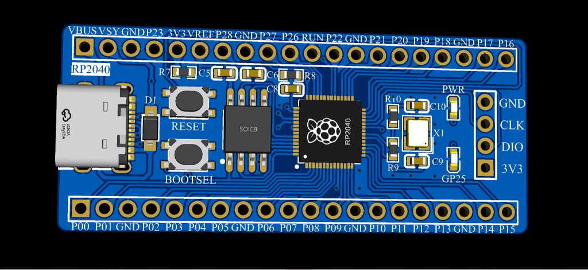
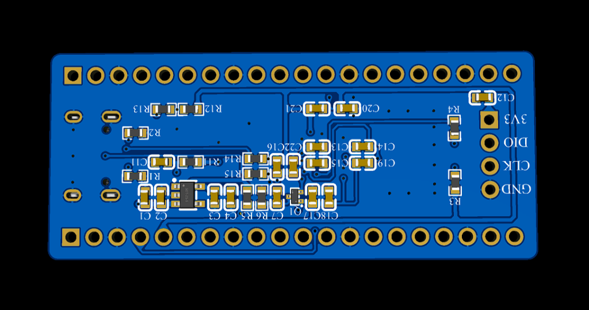
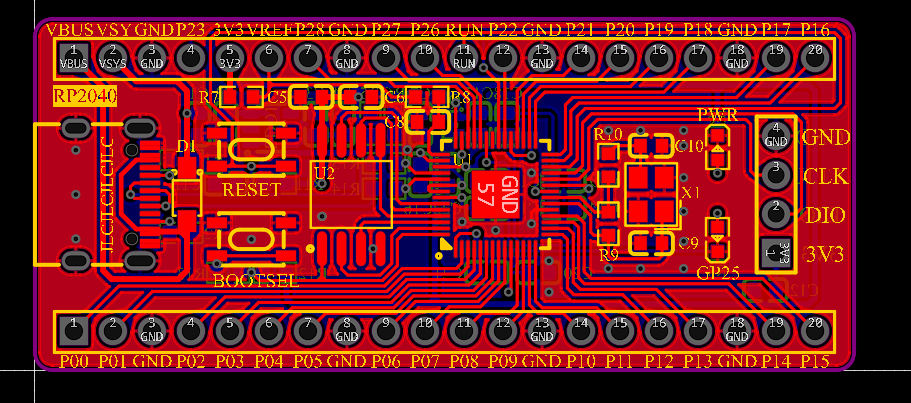
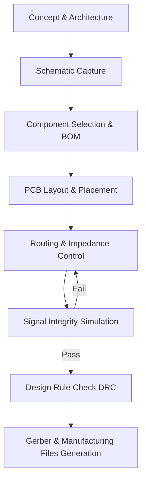

# Custom RP2040 Development Board

## Overview
This repository contains the schematic and PCB design files for a custom-built development board based on the Raspberry Pi RP2040 microcontroller. The board adopts a form factor and pinout heavily inspired by the classic Raspberry Pi Pico, but is built from the ground up to integrate modern features like USB Type-C and custom power delivery. 

## Key Features
*   **Microcontroller:** Raspberry Pi RP2040 (Dual ARM Cortex-M0+ @ 133MHz, 264KB SRAM)
*   **Storage:** 16MB SPI Flash (W25Q128JVSIQ) for generous code/data retention
*   **Connectivity:** Modern USB Type-C connector for reliable data and power 
*   **Power regulation:** 3.3V, 500mA+ LDO regulator (ME6211) providing stable power from 5V VBUS
*   **User controls:** Dedicated RESET and BOOTSEL buttons for seamless firmware uploading and system resets without unplugging the cable.
*   **Debug/Programming:** Exposed SWD (Serial Wire Debug) header 

## 3D Model

Explore the interactive 3D model of the board directly in your browser. GitHub natively supports 3D rendering for STL files!
*   [🕹️ View Interactive 3D Model (.stl)](Hardware/ImageToStl.com_3D_PCB_RP2040_2026-03-04.stl)

## Images

### 3D Render - Top View


### 3D Render - Bottom View


### PCB Layout


## Hardware Design Flow



## Repository Structure

```text
📦 custom-rp2040-board
 ┣ 📂 Hardware
 ┃ ┣ 📂 PCB
 ┃ ┃ ┗ 📂 SCH_RP2040
 ┃ ┃   ┗ 📜 1_SCH_RP2040.schdoc
 ┃ ┣ 📜 PCB_RP2040.pcbdoc
 ┃ ┗ 📜 ImageToStl.com_3D_PCB_RP2040_2026-03-04.stl
 ┣ 📂 Images
 ┃ ┣ 🖼️ media__1772636528703.png
 ┃ ┣ 🖼️ media__1772636528724.png
 ┃ ┗ 🖼️ media__1772636633141.png
 ┗ 📜 README.md
```

## Hardware Design & Signal Integrity Highlights

Special attention was given to the hardware layout and PCB routing to ensure stable operation and good SI (Signal Integrity)—crucial elements when dealing with high-speed digital designs.

### 1. USB Differential Pair Routing
The USB D+ and D- signals between the Type-C connector and the RP2040 USB pins are routed as a **tightly coupled differential pair**.
*   **Impedance Control:** This configuration helps maintain the standard 90Ω differential impedance required by USB 2.0 (Full Speed/12Mbps). 
*   **Noise Immunity:** By routing them intimately together, any external electromagnetic interference (EMI) picked up acts evenly on both traces (common-mode noise), which the differential receiver inside the RP2040 easily ignores.
*   **Emissions Cancellation:** The equal and opposite signal currents along the tracks cause their radiated magnetic fields to cancel each other out, preventing the board from emanating unwanted RF noise.

### 2. Strategic Decoupling Capacitors
Multiple low-ESR ceramic capacitors (0.1µF / 100nF) are placed immediately adjacent to the power pins (VDD, VDDIO, USB_VDD, ADC_AVDD) of both the RP2040 and the SPI Flash chip.
*   Digital ICs pull current in intense, sharp spikes every time millions of transistors switch simultaneously. If these spikes had to travel all the way from the voltage regulator, the inherent inductance of the PCB traces would cause momentary voltage drops (ground bounce/VCC sag). 
*   Placing decoupling capacitors essentially provides local energy reservoirs right at the pins, smoothing the voltage and keeping the logic levels healthy and glitch-free.

### 3. Solid Ground Planes & Return Paths
The PCB leverages a robust copper pour system structure, essentially creating a continuous Ground plane. 
*   High-speed signals don't take the path of least **resistance**; they take the path of least **impedance**, which directly mirrors the signal trace on the nearest adjacent ground plane. 
*   By maintaining an unbroken copper ground layer beneath the digital traces (e.g., the QSPI bus for the Flash memory and the USB lines), the return current loop is kept microscopically small. This dramatically reduces parasitic inductance and virtually eliminates crosstalk between adjacent signals.

### 4. Optimal Crystal Oscillator Layout
The 12MHz crystal (X1) and its associated 15pF load capacitors are located as close as physically possible to the RP2040's oscillator pins.
*   The traces are kept short, symmetrical, and surrounded by ground. This mitigates parasitic trace capacitance, prevents the clock lines from acting as miniature antennas, and keeps external digital noise from coupling into the clock signal, ensuring a pure 12MHz heartbeat for the MCU.

### 5. Type-C UFP Implementation
Unlike older USB protocols, Type-C requires proper termination to negotiate power. The schematic includes 5.1kΩ pull-down resistors on both CC1 and CC2 lines. This correctly identifies the board as an Upstream Facing Port (UFP), ensuring 5V power is reliably provided regardless of cable orientation or if a smart C-to-C intelligent cable is used.

### 6. Post-Layout Signal Integrity (SI) Validations
To guarantee reliable digital performance, extensive post-layout Signal Integrity simulations were performed directly within **Altium Designer**.
*   **Comprehensive Net Analysis:** All critical nets including SWCLK, SWDIO, USB_DP, USB_DN, the QSPI bus, and several general-purpose GPIOs were simulated. Every evaluated net passed the strict threshold criteria for both rising and falling edge overshoot/undershoot.
*   **Reflection Waveforms:** Analysis of reflection waveforms for high-frequency lines (like SWCLK at the RP2040 U1-24 and the header H1-3, as well as GPIO19) demonstrated remarkably clean signal edges. 
*   **Trace Impedance & Termination:** Even without the use of explicit inline series termination resistors, the observed ringing and overshoot maxed out in the low millivolt range (e.g., well under 200mV). This rapid settling time ensures that the signal easily stays within the VIL/VIH logic-level thresholds of the RP2040, preventing any unintended double-clocking or logic evaluation errors.

## Getting Started
To program the board:
1. Hold down the BOOTSEL button.
2. Momentarily press the RESET button.
3. Release the BOOTSEL button. 
4. The board will appear on your computer as a Mass Storage Device (e.g., RPI-RP2).
5. Drag and drop your compiled CMake .uf2 binary onto the drive. 

## Files Included
*   [📄 Schematic Source (.SchDoc)](Hardware/PCB/SCH_RP2040/1_SCH_RP2040.schdoc)
*   [📂 PCB Design Source (.PcbDoc)](Hardware/PCB_RP2040.pcbdoc)
*   [🕹️ 3D Model (.STL)](Hardware/ImageToStl.com_3D_PCB_RP2040_2026-03-04.stl)